# flight-manager - easy way to manage your flights! ✈

# Description

The application consists of a backend REST API built with Spring Boot (flight-manager-spring) and a frontend application created with React.js. 
It allows you to add and remove flights and passengers, as well as manage passengers for selected flights.

## How to Run the Application

### Steps:

1. **Clone the Repository:** Clone this repository to your local machine using the following command in your terminal:

   **HTTPS**
    ```
    git clone https://github.com/Shair13/flight-manager.git
    ```
   **SSH**
   ```
    git clone git@github.com:Shair13/flight-manager.git
    ```

2. **Run the Application:** Navigate to the repository folder and use the Docker Compose command to run the application:

    ```bash
    docker compose up
    ```

3. **Access the Application:** Once the application is running, you can access it through your web browser at the
   following address:

   ```
   http://localhost:3000
   ```

## This is the initial page.

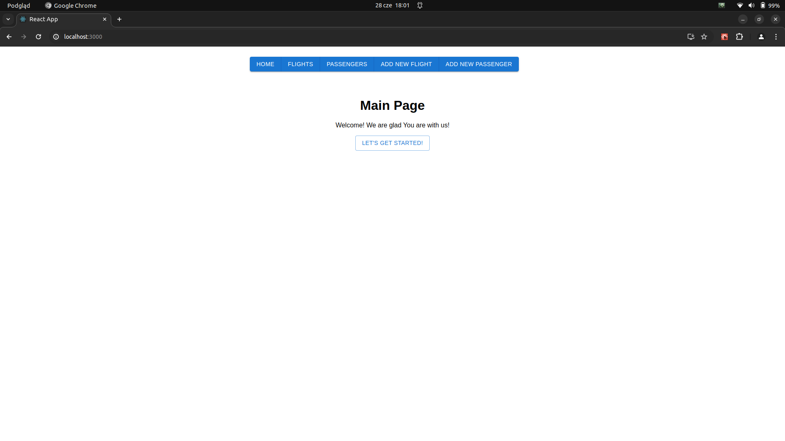

## This page contains a form to add a new flight.


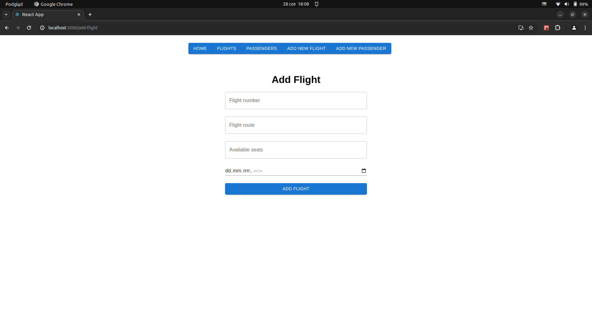

## Validation ensures you enter the correct data.


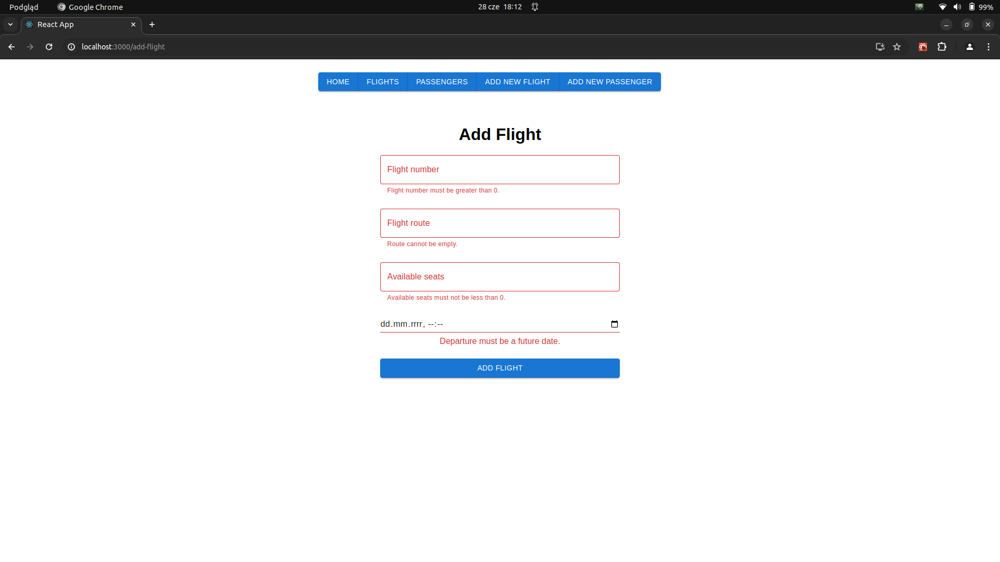

## Here you can view all added flights, check details, or delete them.

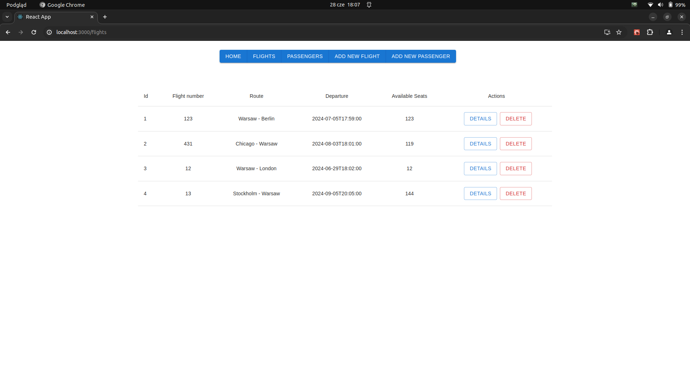

## In the flight details, you can add passengers and update the current flight. Below, you will see all passengers on this flight, and you can remove them by clicking the "X" button.

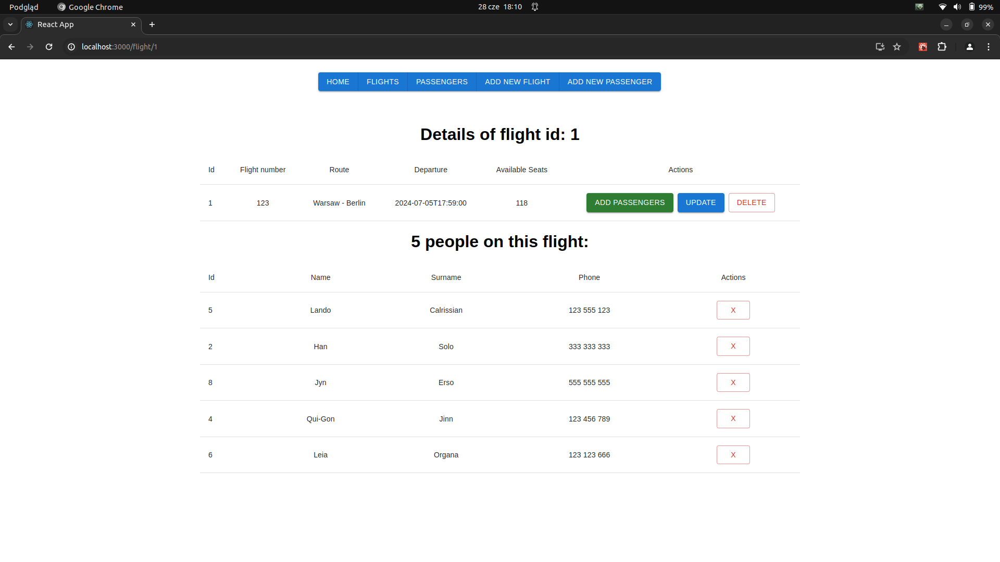

## When you click update, you will be redirected to the flight update form.

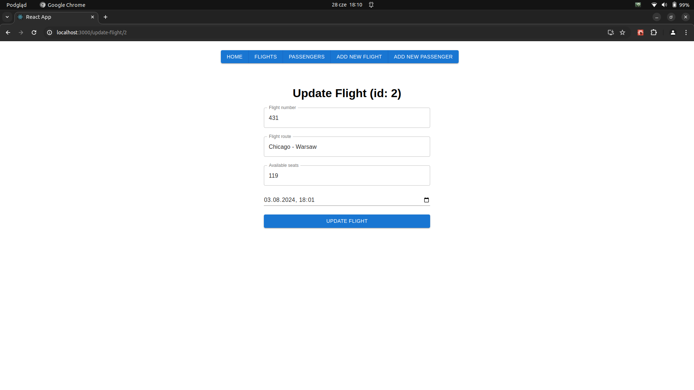

## When adding passengers, you will be redirected to a page showing passengers not already added to the current flight.

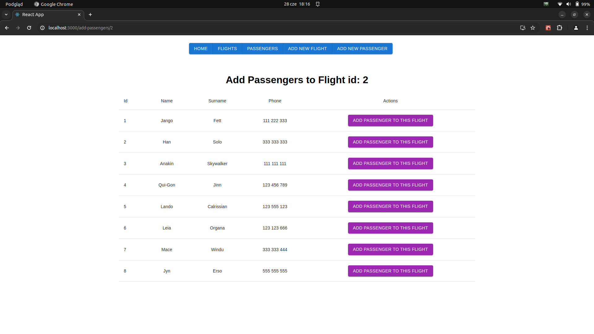

## You cannot add a person who is already added to the same flight.

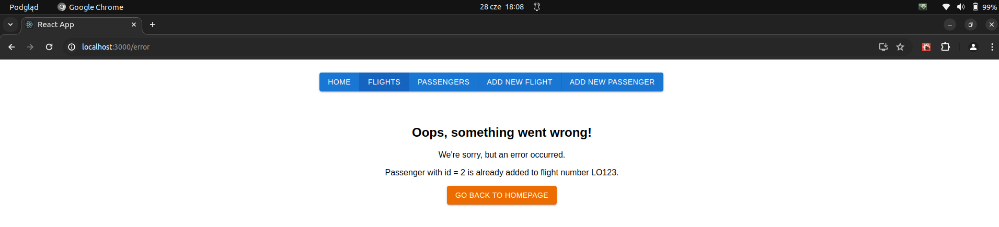

## This page contains a form to add a new passenger.

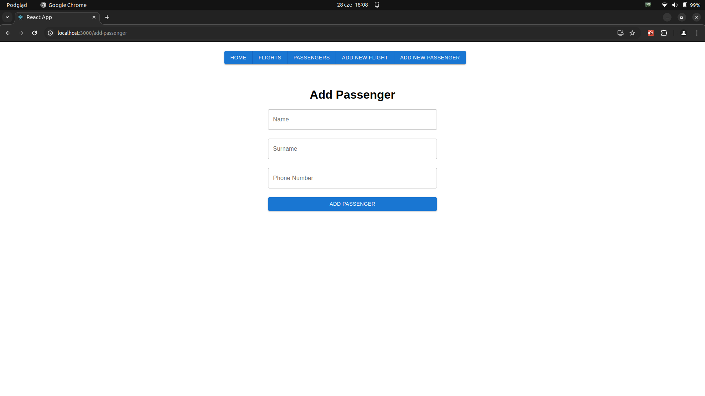

## At this page is form to add new passenger

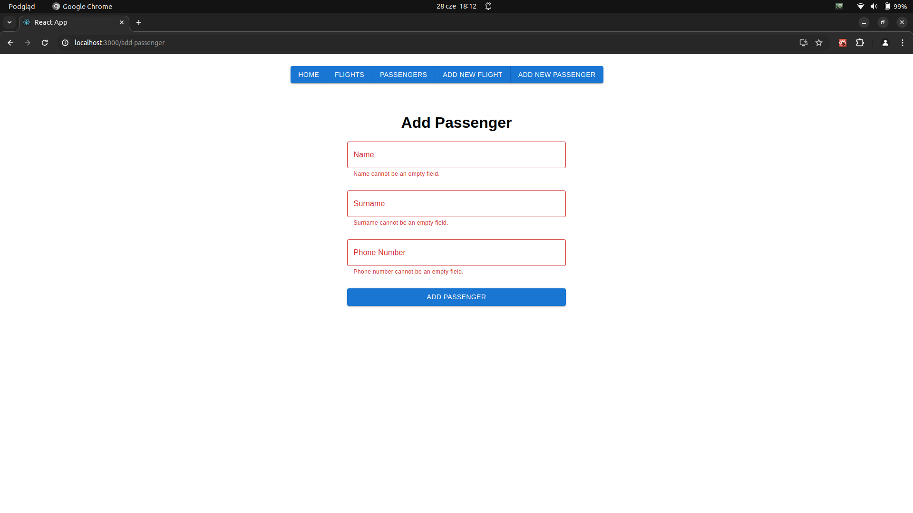

## Validation ensures you enter the correct data.

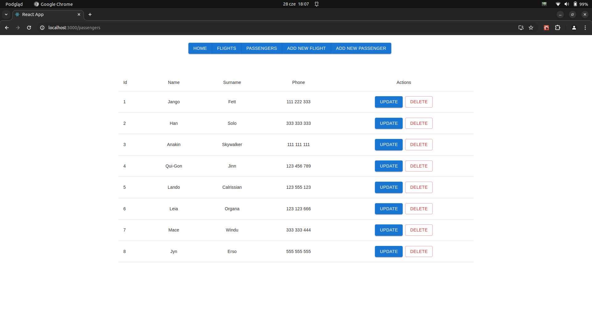

## Here you can view all added passengers and update or delete them.

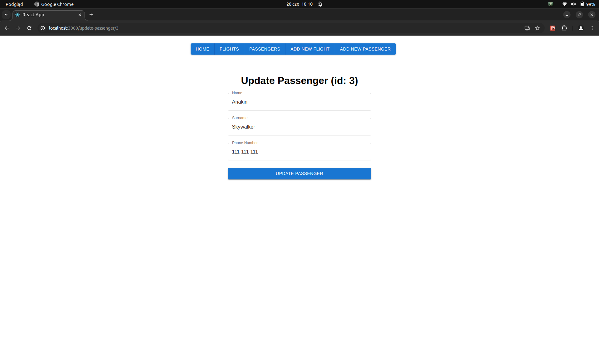

## When you click update, you will be redirected to the passenger update form.

# Contact

Thank you for exploring flight-manager! If you have any questions, feedback or issues, feel free to reach out to me:

- Email: cezary.wozakowski@gmail.com

